# MSE-Face-Recognition-Attendance-System :robot:

## Steps for Running the Web-App on any Remote Device:

1. If Python is not installed on the machine, install Python from this [link](https://www.python.org/downloads/).

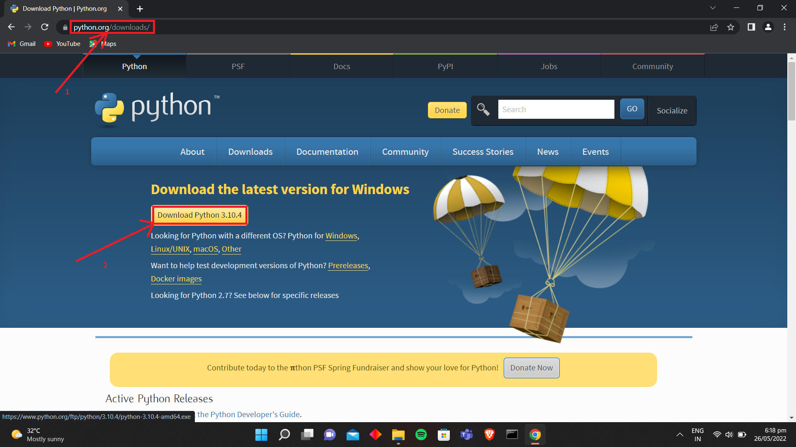

2. It's recommended to add Python to the path. By doing this, it would be directly added to the Environment Variables and then could be accessed from anywhere.

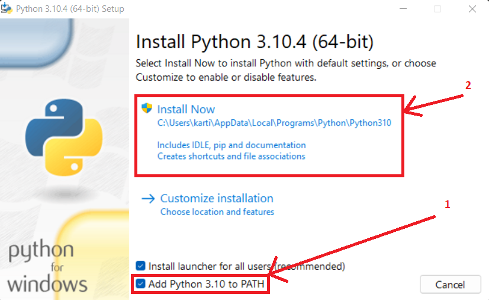

3. If Git is not installed on the machine, install Git from this link [link](https://git-scm.com/downloads).

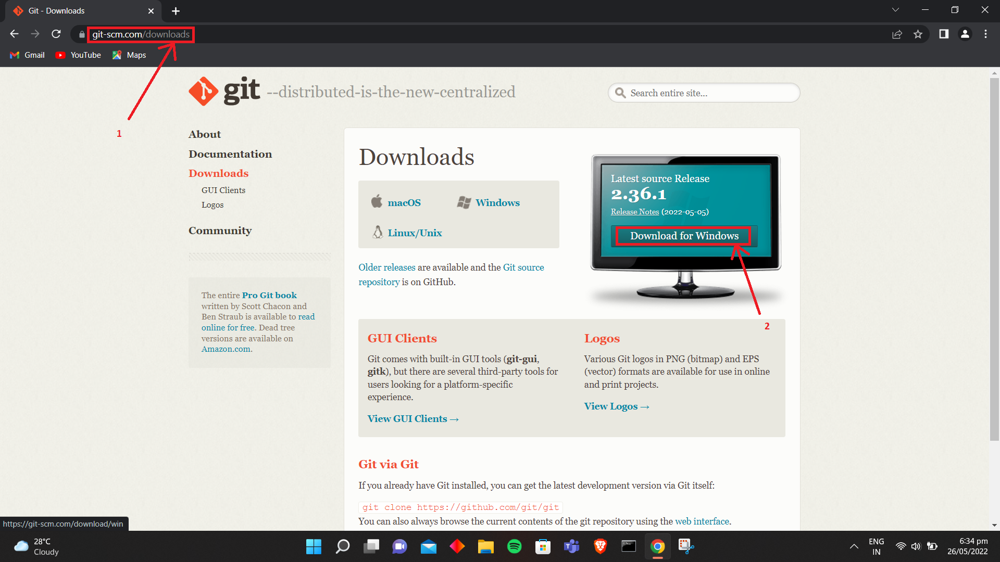

4. Now, go to the [repo](https://github.com/kartikeya47/MSE-Face-Recognition-Attendance-System), and click on **Code**.

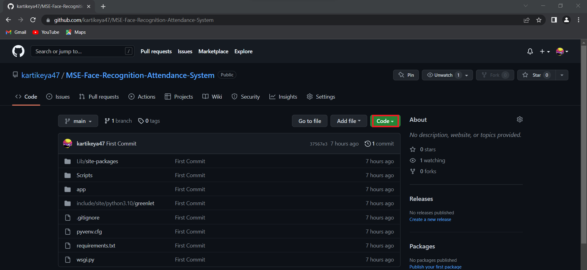

5. Now, click on the **Copy** symbol.

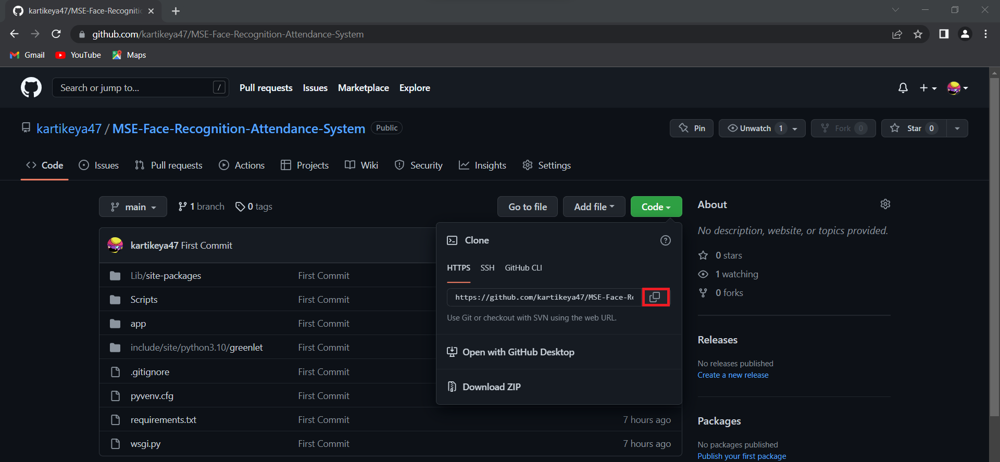

6. Go to the Desktop, and right click. Click on **Git Bash Here**.

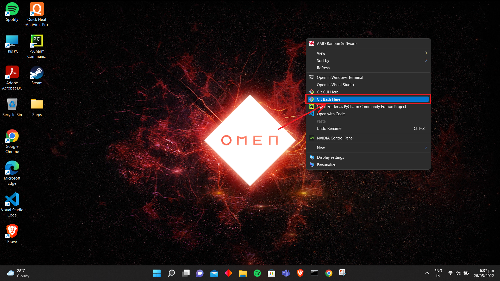

7. Type the following line in the git bash terminal:
```
git clone https://github.com/kartikeya47/MSE-Face-Recognition-Attendance-System.git
```

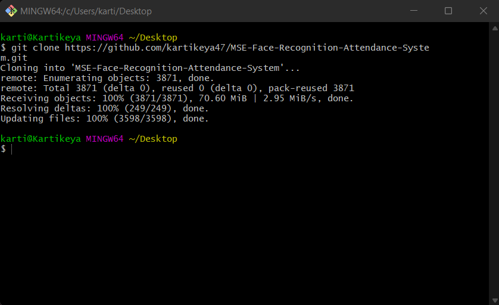

8. Now, it's observable that a folder named **MSE-Face-Recognition-Attendance-System** has been created in the Desktop.

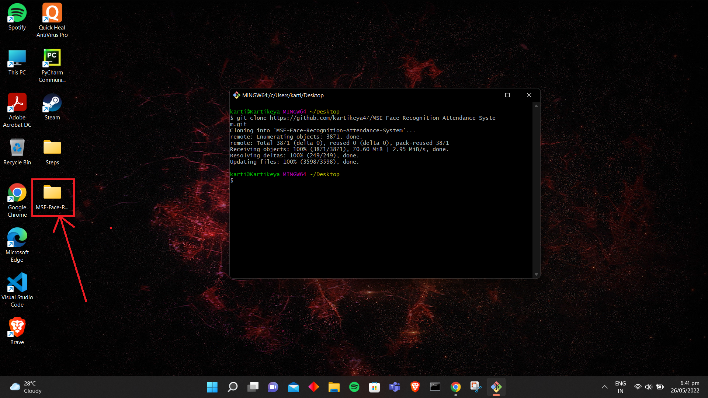

9. Type in the following commands in the git bash terminal now:
```
cd MSE-Face-Recognition-Attendance-System
```
```
cd Scripts
```
```
source activate
```
```
cd ..
```

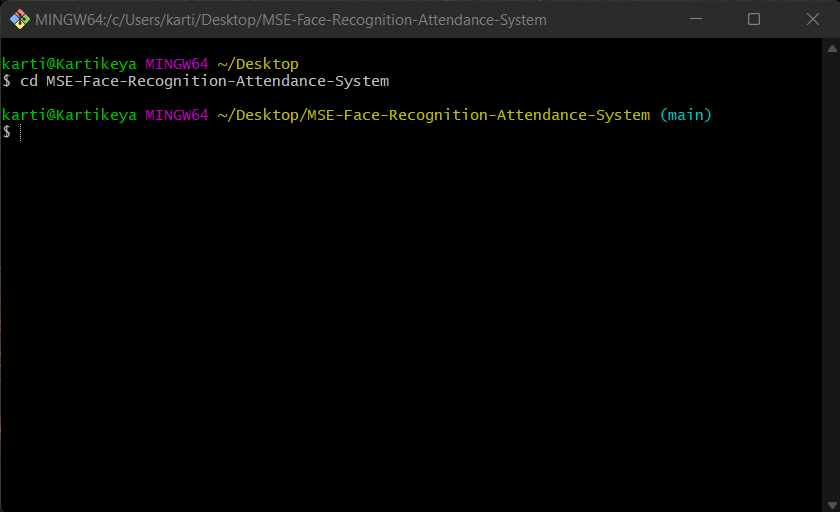

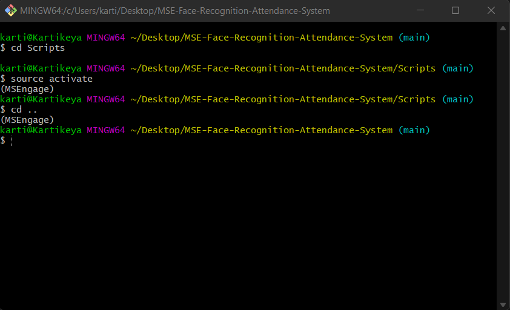

The above steps have activated the **Python Virtual Environment**.

10. Now, it's time to install the necessary Python Packages that are required to run the Web App:

```
pip install -r requirements.txt
```

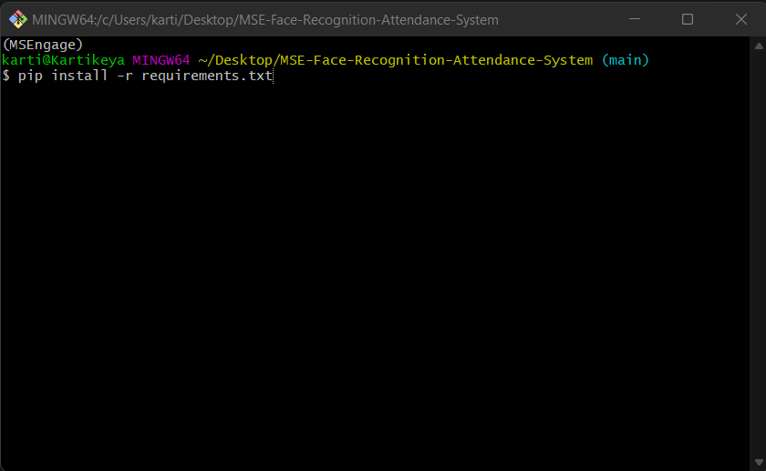

11. Now, all the major steps have taken place. Type the following command in the Git Bash Terminal to run the Web App:

```
python wsgi.py
```

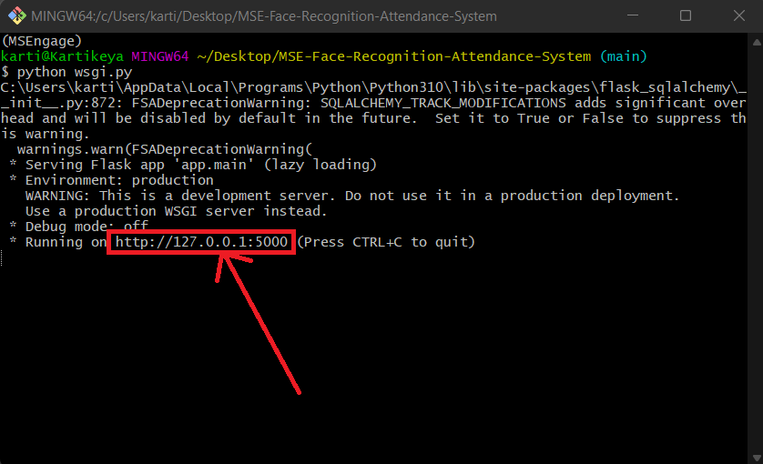

## Optional (If someone wants to delete the existing database, and create a new one):

1. Delete the existing **database.db**.

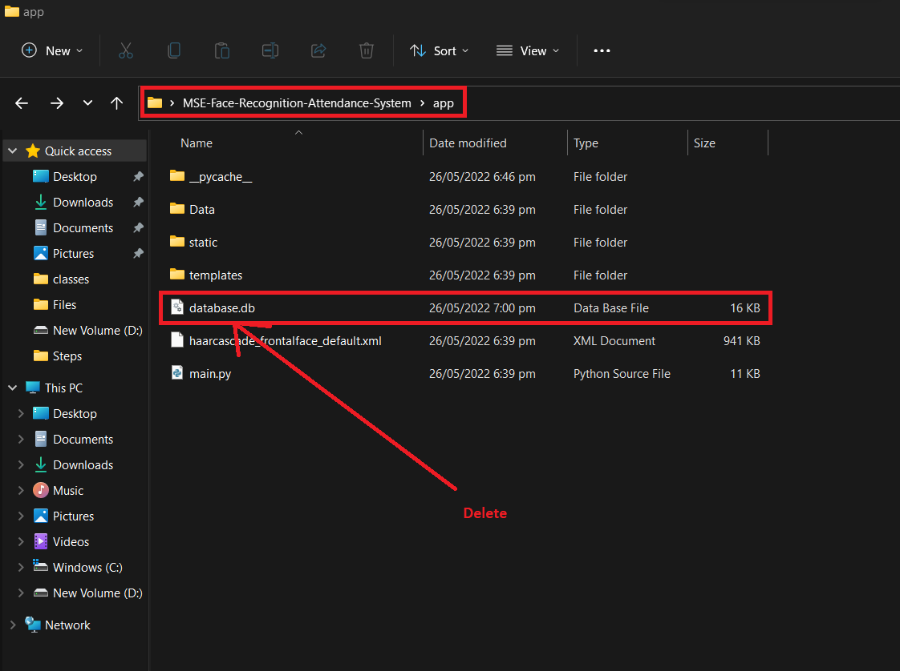

2. Now, open any terminal in the **MSE-Face-Recognition-Attendance-System** Directory and type **python** in it.

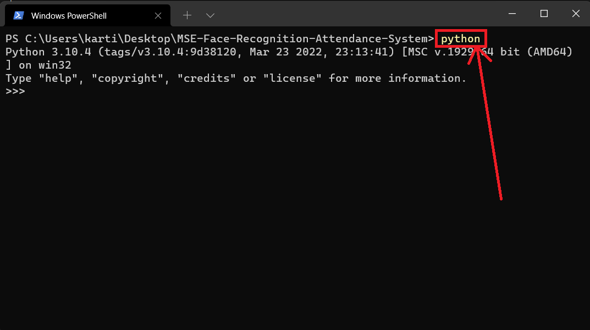

3. Now type the following to import the db class:
```
from app.main import db
```

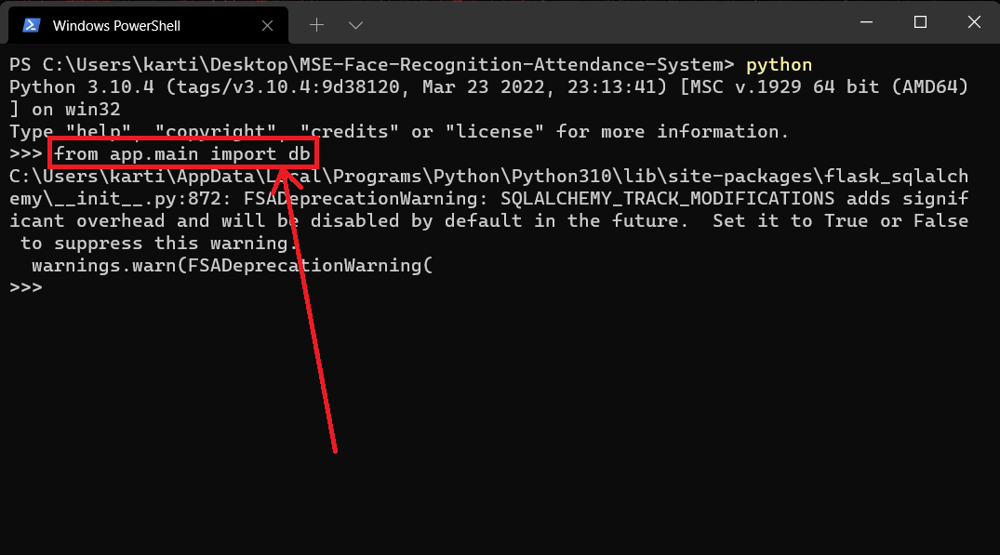

4. Now, for creating the database, type:
```
db.create_all()
```

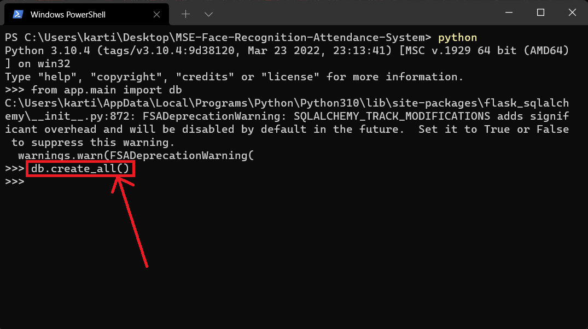

5. Now, type:

```
exit()
```


